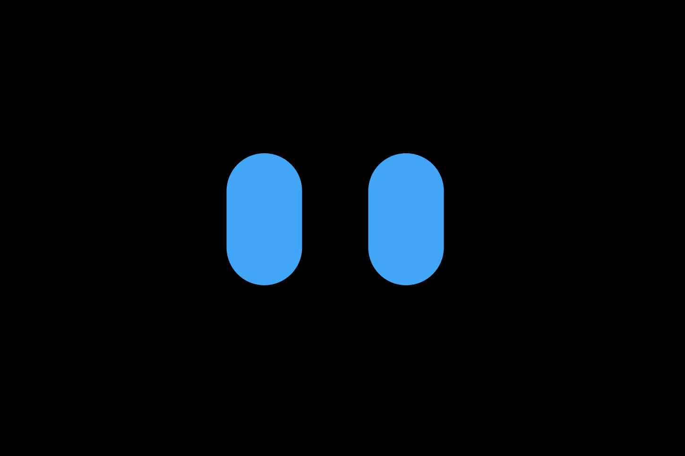

# Prototype Web - AI Companion (v1.0.1)

> **Note:** This project is currently in the **Prototype 1** stage. 

*(Placeholder: Insert screenshot of the Prototype Eye UI here)*

Prototype Web is a multimodal, real-time AI assistant capable of seeing, listening, speaking, and remembering. Built with a focus on edge computing and microservices, it leverages high-speed language models, real-time object tracking on the browser, and long-term semantic memory.
> **Note:** You can check out the branch ` local-version `, it is the local version and this web version is developed base on it.
## Live Access

The project is deployed using a decoupled approach, separating the public landing page from the secure application via Cloudflare Zero Trust:

*   **Public Landing Page:** [https://prototype.convolution-nguyen-anh-duong.id.vn](https://prototype.convolution-nguyen-anh-duong.id.vn)
<!-- *   **Secure Private App (Zero Trust):** [https://app.prototype.convolution-nguyen-anh-duong.id.vn](https://app.prototype.convolution-nguyen-anh-duong.id.vn) *(Requires @hcmut.edu.vn authentication)* -->

---

## System Architecture

<!-- 
*(Placeholder: Insert AWS-style Solution Architecture Diagram here)* -->

The system is built on a decoupled architecture, ensuring that heavy AI inference does not block real-time I/O or the graphical user interface.

### 1. Front-End Architecture (Edge Computing)
The frontend is a lightweight Single Page Application (SPA) built with Vanilla JavaScript and HTML5 Canvas. To achieve a consistent 60 FPS rendering speed, the architecture decouples tasks across multiple threads:

*   **UI & Physics Thread:** Utilizes `requestAnimationFrame` and Canvas clipping to render the eye geometry and physics (gaze tracking, blinking, and emotional states) smoothly.
*   **Background AI Worker:** A dedicated Web Worker loads TensorFlow.js and the COCO-SSD model. It processes downscaled webcam frames (320x240) at a limited 15 FPS to track user coordinates without blocking the main browser thread.
*   **Orchestrator:** Manages the State Machine, handles push-to-talk audio recording (WebM), captures high-resolution frames for the backend vision system, and maintains a persistent WebSocket connection.
*   **Deployment Separation:** The repository cleanly separates the public-facing promotional landing page from the core application, allowing independent Cloudflare Pages deployments and strict Zero Trust policy enforcement on the application subdomain.

### 2. Back-End Architecture (Microservices Integration)
The backend is powered by FastAPI and hosted on Render, operating entirely asynchronously to handle real-time WebSocket streams. It coordinates multiple third-party AI services:

*   **Groq API (Speed-Optimized LLM & Audio):**
    *   **STT:** Uses `whisper-large-v3-turbo` for lightning-fast speech-to-text transcription.
    *   **LLM:** Uses `qwen/qwen3.8-27b` to synthesize responses, evaluate tool context, and generate emotional tags.
    *   **TTS:** Uses `canopylabs/orpheus-v1-english` for immediate voice generation.
*   **NVIDIA NIM (Deep Vision):**
    *   Whenever the user mentions the keyword "vision", a high-resolution Base64 frame is routed to the `meta/llama-3.2-11b-vision-instruct` model to extract environmental context.
*   **Pinecone (Long-term Semantic Memory):**
    *   Acts as the system's hippocampus (RAG). 
    *   Utilizes Pinecone's native Inference API (`multilingual-e5-large`) to generate 1024-dimensional embeddings directly, storing and retrieving memories partitioned by the user's authenticated Cloudflare email.
    *   Memory upsertion is handled as a background task (fire-and-forget) to ensure zero latency in the conversational response loop.

---

## Core Features

*   **Zero-Latency Edge Vision:** The eyes follow you in real-time using on-device tracking (TFJS), while deep semantic understanding of the scene is offloaded to Llama 3.2 Vision on the cloud.
*   **Expressive UI:** Pure HTML5 Canvas implementation of emotional states (`[normal]`, `[happy]`, `[sad]`) triggered by LLM reasoning.
*   **Continuous Memory:** Remembers user preferences and past interactions across different sessions using Pinecone Vector DB.
*   **Enterprise-Grade Security:** Locked behind Cloudflare Zero Trust, decoding JWT tokens directly on the edge to identify users and partition database records securely.

---

## Credits & Organization

*   **Developer:** Duong Anh Nguyen
*   **Organization:** Agentivium AI / HCMC University of Technology VNU-HCM